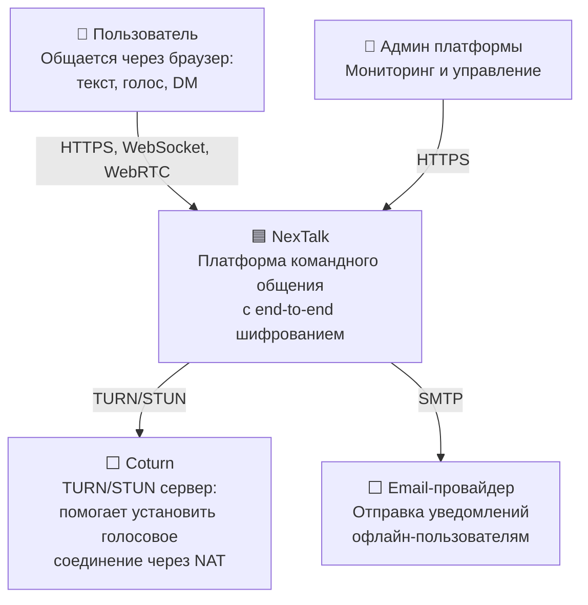
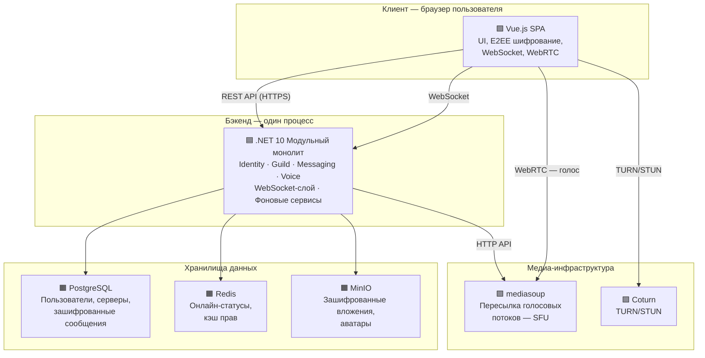

# NexTalk

Платформа для командного общения с end-to-end шифрованием. Аналог Discord, но сервер не может прочитать переписку и разговоры — всё шифрование происходит в браузере пользователя.

---

## Содержание

1. [Проблема и идея](#1-проблема-и-идея)
2. [Что строим (MVP)](#2-что-строим-mvp)
3. [Команда и процесс](#3-команда-и-процесс)
4. [Пользователи и сценарии](#4-пользователи-и-сценарии)
5. [Архитектура](#5-архитектура)
6. [Модули системы](#6-модули-системы)
7. [Как работает шифрование (E2EE)](#7-как-работает-шифрование-e2ee)
8. [Где хранятся данные](#8-где-хранятся-данные)
9. [Фронтенд](#9-фронтенд)
10. [План разработки по этапам](#10-план-разработки-по-этапам)
11. [За рамками MVP и открытые вопросы](#11-за-рамками-mvp-и-открытые-вопросы)
12. [Глоссарий](#12-глоссарий)

---

## 1. Проблема и идея

### Что это такое

NexTalk — это веб-платформа для общения, похожая на Discord: пользователи создают **серверы**, внутри серверов — **текстовые и голосовые каналы**, есть **роли и права доступа**, **личные сообщения** и **уведомления**.

Главное отличие: **все сообщения и звонки зашифрованы так, что сервер не может их прочитать**. Шифрование и расшифровка происходят только в браузере пользователя (см. [Глоссарий → E2EE](#e2ee-end-to-end-encryption)).

### Для кого

Геймеры, удалённые команды, группы друзей — те, кому нужен общий голосовой и текстовый хаб с гарантией конфиденциальности.

### А разве Discord, Slack и Teams не шифруют?

Частично, но не полностью:

| Платформа | Текстовые сообщения | Голос / видео | Итог |
|:--|:--|:--|:--|
| **Discord** | TLS — сервер **видит текст** | E2EE с 2024 года (протокол DAVE) | Текст не защищён от сервера |
| **Slack** | TLS — сервер **видит текст** | Нет E2EE | Ничего не зашифровано end-to-end |
| **Teams** | TLS — сервер **видит текст** | E2EE только для звонков 1-на-1 | Групповые чаты не защищены |

> **Разница между TLS и E2EE.** TLS шифрует данные «в дороге» — от браузера до сервера. Но на сервере данные расшифровываются, и сервер их видит. E2EE шифрует данные так, что расшифровать их может только получатель. Сервер хранит бессмысленный набор байтов.

**Ни одна из этих платформ** не предлагает E2EE для текстовых сообщений в модели серверов и каналов. NexTalk закрывает именно этот пробел.

---

## 2. Что строим (MVP)

MVP — минимальный набор функций, достаточный для того, чтобы платформой можно было реально пользоваться и показать её на демо.

### Входит в MVP

- **Регистрация и вход** (email + пароль). При первом входе браузер автоматически создаёт ключи шифрования.
- **Серверы**: создание, настройка ролей и прав доступа, текстовые и голосовые каналы.
- **Текстовый чат с E2EE**: сообщения шифруются в браузере, сервер хранит только зашифрованный blob (см. [Глоссарий](#blob)).
- **Голосовые каналы**: разговор в реальном времени через браузер (WebRTC + SFU, см. [Глоссарий](#sfu-selective-forwarding-unit)).
- **Личные сообщения** (DM) с E2EE.
- **Онлайн-статусы**: видно, кто сейчас в сети.
- **Модерация**: кик и бан участников, удаление сообщений.
- **Инвайт-ссылки** для приглашения на сервер (с ограничением по времени и количеству использований).
- **Email-уведомления** для офлайн-пользователей (только метаданные — кто написал и куда, без текста сообщения).

### Не входит в MVP

Эти функции **не реализуются сейчас**, но архитектура не должна закрывать к ним дорогу:

- Вход через Google / GitHub (OAuth).
- Мобильное приложение.
- Push-уведомления.
- Signal Protocol (продвинутое шифрование с forward secrecy) — слишком сложен для первой версии.
- Резервное копирование ключей шифрования.
- Реакции на сообщения, индикатор «печатает...», Markdown.
- Масштабирование на несколько серверов.

---

## 3. Команда и процесс

### Состав команды

Нас четверо. У каждого — своя основная зона, но все помогают друг другу при необходимости.

| Кто                            | Что делает                                                                                                                    | Основной фокус                                          |
| :----------------------------- | :---------------------------------------------------------------------------------------------------------------------------- | :------------------------------------------------------ |
| **Архитектор / DevOps / PM**   | Владеет архитектурой и инфраструктурой. Ведёт проект. **Пишет .NET backend** (Guild, Voice, WebSocket-слой, фоновые сервисы). | Docker, CI, проектирование модулей, .NET backend        |
| **Backend-разработчик (+ QA)** | Пишет .NET backend-модули (Identity, Messaging) и тесты. Отвечает за QA.                                                      | Identity, Messaging, интеграционные и E2E тесты         |
| **Frontend-разработчик 1**     | UI + E2EE на клиенте.                                                                                                         | Авторизация, чат, шифрование/расшифровка в браузере, DM |
| **Frontend-разработчик 2**     | UI + голосовые каналы на клиенте.                                                                                             | Навигация, голос (WebRTC), администрирование, статусы   |

> Архитектор и Backend-разработчик **оба пишут .NET-код**. Архитектор берёт модули с инфраструктурным уклоном, Backend — бизнес-логику и тесты.
>
> Подробное распределение задач по этапам и людям — в [TASKS.md](tasks.md).

### Как работаем

**Методология: Kanban** — простая доска задач без жёстких спринтов. Подходит для маленькой команды, где объём работы плохо предсказуем.

| Элемент | Как применяем |
|:--|:--|
| **Доска задач** | GitHub Projects. Колонки: `Backlog` → `In Progress` → `Review` → `Done` |
| **Ограничение WIP** | Не более 2 задач одновременно на человека |
| **Еженедельный синк** | 30 минут: каждый показывает, что работает, обсуждаем блокеры |
| **Ветки и PR** | Feature branch → Pull Request → Review → Merge |
| **Этапы** | 4 этапа по ~2 недели. Каждый заканчивается рабочей демо-версией |

> **Почему не Scrum?** Scrum требует ежедневных стендапов, планирования спринтов и отдельного скрам-мастера. Для четырёх человек в учебном проекте это лишний overhead. Kanban проще: берёшь задачу → делаешь → двигаешь по доске.

---

## 4. Пользователи и сценарии

### Роли

| Роль | Что может делать | Как получает роль |
|:--|:--|:--|
| **Владелец сервера** | Полный контроль: каналы, роли, удаление сервера | Создал сервер |
| **Администратор** | Управление каналами и ролями, модерация | Назначен владельцем |
| **Модератор** | Кик/бан в своих каналах, удаление сообщений | Назначен администратором |
| **Участник** | Писать сообщения, участвовать в голосовых каналах | Принял инвайт |
| **Админ платформы** | Мониторинг, блокировка пользователей/серверов | Технический доступ |

> **Важно:** из-за E2EE **ни администратор сервера, ни администратор платформы не могут прочитать сообщения**. Модератор может удалить сообщение (удаляется зашифрованный blob), но содержимое ему недоступно.

### Основные сценарии

**Регистрация и вход.** Пользователь вводит email и пароль → система создаёт аккаунт и выдаёт токен доступа (JWT, см. [Глоссарий](#jwt-json-web-token)). При первом входе на устройстве браузер генерирует пару ключей шифрования: публичный отправляется на сервер, приватный остаётся только в браузере.

**Создание сервера.** Пользователь создаёт сервер, настраивает каналы и роли. Генерирует инвайт-ссылку и отправляет друзьям. Когда кто-то вступает, его публичный ключ используется для передачи ему ключей шифрования каналов (подробнее — в разделе [E2EE](#7-как-работает-шифрование-e2ee)).

**Отправка сообщения.** Браузер шифрует текст канальным ключом и отправляет blob на сервер. Сервер сохраняет blob (не зная содержимого) и рассылает всем онлайн-участникам канала через WebSocket. Каждый получатель расшифровывает в своём браузере.

**Голосовой канал.** Пользователь нажимает «Войти» → браузер устанавливает зашифрованное соединение с медиасервером (SFU). Голос передаётся через WebRTC: зашифрованные пакеты пересылаются между участниками без раскодирования на сервере.

**Личные сообщения (DM).** Аналогично каналу, но между двумя людьми. Сообщение шифруется публичным ключом собеседника.

**Модерация.** Администратор кикает/банит участника → тот сразу отключается от WebSocket и голосового канала. При бане ключи каналов обновляются, чтобы забаненный не мог расшифровать будущие сообщения.

**Онлайн-статусы.** Браузер каждые 20 секунд отправляет heartbeat (см. [Глоссарий](#heartbeat)). Если heartbeat не пришёл — через 30 секунд пользователь считается офлайн. Статусы видны только участникам общих серверов.

**История сообщений.** При открытии канала загружаются последние сообщения (blob). Расшифровка — в браузере. При прокрутке вверх подгружается история.

**Уведомления.** Если пользователь офлайн — приходит email. Содержит только метаданные (кто написал, в каком канале), без текста — сервер его не знает.

---

## 5. Архитектура

> **Подробная C4-модель с JSON для импорта в IcePanel** — в [C4-MODEL.md](C4-model.md). Там же описаны Flows для основных сценариев и Component-диаграмма (.NET монолит, Level 3).

### Контекст системы (C4 Level 1)

Самый верхний уровень: кто взаимодействует с NexTalk и какие внешние системы задействованы.



| Элемент | Что это | Зачем нужен |
|:--|:--|:--|
| Пользователь | Человек в браузере | Основной потребитель системы |
| Админ платформы | Технический специалист | Следит за работоспособностью, блокирует нарушителей |
| Coturn | Сервер для обхода NAT (см. [Глоссарий](#nat-network-address-translation)) | Без него голос не работает у ~30% пользователей за NAT |
| Email-провайдер | Внешний SMTP-сервис | Шлёт email-уведомления офлайн-пользователям |

### Из чего состоит система (C4 Level 2)

Один уровень глубже: из каких запускаемых компонентов и хранилищ состоит NexTalk.



**6 компонентов для запуска** (все описываются в `docker-compose.yml`):

| Компонент | Что это | Зачем |
|:--|:--|:--|
| **.NET монолит** | Один процесс со всеми модулями | Вся бизнес-логика: авторизация, серверы, сообщения, голос |
| **PostgreSQL** | Реляционная база данных | Постоянное хранение: пользователи, серверы, сообщения |
| **Redis** | In-memory хранилище | Временные данные: кто онлайн, кэш прав |
| **MinIO** | S3-совместимое хранилище | Зашифрованные файлы (вложения) и аватары |
| **mediasoup** | Медиасервер (Node.js) | Пересылка зашифрованных голосовых потоков |
| **Coturn** | TURN/STUN сервер | Помогает установить WebRTC через NAT |

### Почему модульный монолит, а не микросервисы

| Вопрос | Ответ |
|:--|:--|
| Нас четверо? | Один процесс = один деплой, одна отладка, один лог. Нет overhead на сетевое взаимодействие между сервисами. |
| Учебный проект? | Простота важнее теоретической масштабируемости. Проще показать и объяснить на демо. |
| А если потом нужно масштабировать? | Модули общаются через чёткие интерфейсы. Любой модуль можно вынести в отдельный сервис, заменив внутренний вызов на HTTP-запрос. Для MVP это не нужно. |

---

## 6. Модули системы

Монолит состоит из **четырёх бизнес-модулей** и двух вспомогательных слоёв. Каждый модуль отвечает за свою область и не лезет напрямую в данные другого модуля.

### Identity — «Кто ты?»

**Отвечает за:** регистрацию, вход, токены, профили пользователей и публичные ключи шифрования.

**Пример:** Маша регистрируется. Identity создаёт аккаунт, хеширует пароль, выдаёт JWT-токен. Когда браузер Маши генерирует ключи шифрования, Identity сохраняет её публичный ключ — чтобы другие могли шифровать для неё сообщения.

**Почему отдельный модуль:** аутентификация и ключи — основа безопасности. Их смешивание с логикой серверов или сообщений усложнит контроль доступа к чувствительным данным.

### Guild — «Где ты общаешься?»

**Отвечает за:** серверы, каналы, роли и права доступа, инвайт-ссылки, модерацию (кик/бан).

**Пример:** Маша создаёт сервер «Игроманы», внутри — текстовый канал `#общий` и голосовой `Голос-1`. Она настраивает роль «Модератор» с правом кикать. Генерирует инвайт и отправляет Пете. Петя вступает с ролью «Участник».

**Почему отдельный модуль:** управление правами — сложная логика сама по себе. Её используют все остальные модули: Messaging проверяет «может ли пользователь писать в этот канал», Voice — «может ли подключиться к голосу».

**Как работают права:** каждая роль хранит набор разрешений в виде числа — bitmask (см. [Глоссарий](#bitmask-битовая-маска)). Проверка — быстрая побитовая операция. Результат кэшируется в Redis.

> 📌 **Требует исследования:** конкретный набор permissions для bitmask.

### Messaging — «Что ты пишешь?»

**Отвечает за:** приём и хранение зашифрованных сообщений, историю, вложения, личные сообщения.

**Пример:** Петя пишет «Привет!» в `#общий`. Его браузер шифрует текст канальным ключом → получается blob. Messaging принимает blob, сохраняет в базу и ставит событие в очередь для отправки через WebSocket. Модуль **не знает содержимого** — для него это просто набор байтов.

**Почему отдельный модуль:** сообщения — самый нагруженный модуль. Отделение позволяет оптимизировать его независимо.

> 📌 **Требует исследования:** стратегия хранения истории (партиционирование таблиц).

### Voice — «Что ты говоришь?»

**Отвечает за:** голосовые сессии и WebRTC-сигналинг (обмен техническими данными для установки соединения). Связывает браузер пользователя с медиасервером (mediasoup).

**Пример:** Маша нажимает «Войти» в `Голос-1`. Voice проверяет права, создаёт «комнату» на mediasoup и передаёт браузеру данные для WebRTC-соединения. Когда Петя тоже заходит, mediasoup пересылает зашифрованные голосовые пакеты между ними без раскодирования.

**Почему отдельный модуль:** голос — принципиально другой тип трафика (real-time, UDP). И mediasoup — отдельный процесс, с которым нужно общаться по HTTP API.

> 📌 **Требует исследования:** конфигурация mediasoup, HTTP API, настройка Coturn.

### WebSocket-слой — «Как доставляются события?»

Это **не бизнес-модуль**, а инфраструктурный слой. Управляет постоянными WebSocket-соединениями: кто подключён, кому что отправить. Здесь же живёт логика онлайн-статусов: heartbeat каждые 20 секунд, запись в Redis с TTL.

**Пример:** Маша открыла NexTalk → браузер установил WebSocket → слой зарегистрировал «Маша онлайн». Когда Петя отправляет сообщение, WebSocket-слой находит всех онлайн-участников канала и рассылает blob.

### Фоновые сервисы — «Что происходит в тени?»

Это фоновые задачи **внутри того же .NET-процесса** (не отдельные программы):

1. **Outbox Relay** — читает таблицу `outbox_messages` из PostgreSQL и публикует события во внутреннюю очередь. Гарантирует, что событие не потеряется при сбое (см. [Глоссарий → Outbox Pattern](#outbox-pattern)).
2. **Notification Service** — читает события из очереди и отправляет email офлайн-пользователям. Уведомления содержат только метаданные (кто, куда, когда — без текста).

> **Почему не Kafka?** Для одного процесса с двумя фоновыми задачами достаточно встроенного механизма очередей. Kafka добавляет ещё один компонент для деплоя и настройки. Если в будущем понадобится — интерфейс очереди заменяется без изменения бизнес-логики.

---

## 7. Как работает шифрование (E2EE)

Основная архитектурная особенность проекта. Суть: **сервер хранит зашифрованные данные, к которым у него нет ключей**.

### Ключи пользователя

У каждого пользователя — **пара ключей**:

- **Приватный ключ** — создаётся в браузере при первом входе через Web Crypto API, хранится в IndexedDB (см. [Глоссарий](#indexeddb)). **Никогда не покидает устройство.**
- **Публичный ключ** — отправляется на сервер, доступен другим пользователям для шифрования.

> ⚠️ **Важный trade-off:** потеря устройства или очистка браузера = потеря приватного ключа = потеря доступа к истории. Резервное копирование ключей — за рамками MVP.

### Шифрование в текстовых каналах

Модель **один симметричный ключ на канал**:

1. Создатель канала генерирует случайный **канальный ключ** (AES-256-GCM).
2. Канальный ключ шифруется публичным ключом (X25519) **каждого участника** и публикуется на сервер. Каждый получает свою зашифрованную копию.
3. При вступлении нового участника — текущий участник шифрует канальный ключ публичным ключом нового и публикует на сервер.
4. При отправке сообщения — браузер шифрует текст канальным ключом. На сервер уходит blob.
5. При получении — браузер расшифровывает blob канальным ключом.
6. При кике/бане — канальный ключ **пересоздаётся** и раздаётся оставшимся. Исключённый не расшифрует будущие сообщения.

> **Почему не шифровать каждое сообщение публичным ключом каждого участника?** Если в канале 100 человек — 100 операций шифрования на каждое сообщение. Один канальный ключ — одна операция, независимо от числа участников.

### DM

Личные сообщения шифруются публичным ключом собеседника. Два участника — дополнительной сложности нет.

### Голос

Голосовые потоки шифруются WebRTC-протоколом (DTLS/SRTP). Медиасервер пересылает зашифрованные пакеты, не раскодируя.

### Вложения

Файл шифруется канальным ключом в браузере **перед загрузкой**. MinIO хранит зашифрованные байты.

> 📌 **Требует исследования:** реализация X25519 + AES-256-GCM через Web Crypto API; механизм ротации канальных ключей при бане; хранение зашифрованных канальных ключей на сервере.

---

## 8. Где хранятся данные

### PostgreSQL — основное хранилище

Одна база данных, разделённая на **схемы** (schema) — по одной на модуль. Модуль работает только со своей схемой.

| Схема | Что хранит | Модуль |
|:--|:--|:--|
| `identity` | Пользователи, хеши паролей, токены, публичные ключи, профили | Identity |
| `guild` | Серверы, каналы, роли, участники, инвайты, баны | Guild |
| `messaging` | Зашифрованные сообщения (blob), DM, вложения, outbox | Messaging |

> **Зачем разделять на схемы?** Чтобы модули не лезли в данные друг друга. Если модулю нужны чужие данные — он обращается через интерфейс модуля-владельца. Это правило критично, если в будущем нужно вынести модуль в отдельный сервис.

### Redis — быстрое временное хранилище

| Что хранит | Зачем |
|:--|:--|
| Онлайн-статусы | Heartbeat с TTL 30 сек — нет heartbeat = пользователь офлайн |
| Кэш прав доступа | Не ходить в PostgreSQL на каждую проверку прав |
| Голосовые сессии | Кто сейчас в каком голосовом канале |
| Rate limiting | Защита от спама: не более N запросов в секунду |

### MinIO — хранилище файлов

S3-совместимое объектное хранилище. Хранит зашифрованные вложения и аватары. Клиент шифрует файл **до** загрузки — MinIO хранит непонятный набор байтов.

---

## 9. Фронтенд

### Технологии

| Технология                | Зачем нужна                                                    |
| :------------------------ | :------------------------------------------------------------- |
| **Vue.js 3 + TypeScript** | UI-фреймворк. TypeScript ловит ошибки при написании кода       |
| **Pinia**                 | Хранение состояния: серверы, каналы, сообщения, статусы, ключи |
| **Vue Router**            | Навигация, route guards для проверки авторизации               |
| **vue-virtual-scroller**  | Рендерит только видимые сообщения — без этого чат зависнет     |
| **Web Crypto API**        | Встроенный в браузер API для шифрования                        |
| **WebSocket API**         | Встроенный в браузер API для связи в реальном времени          |
| **WebRTC API**            | Встроенный в браузер API для голоса                            |

### Layout

```
+----------+------------------+-------------------------+-------------+
| Серверы  |  Каналы сервера  |      Чат / голос        |  Участники  |
| (иконки) |                  |                         |  онлайн     |
|          |  # общий         |  [сообщения]            |             |
|  [S1]    |  # новости       |  [сообщения]            |  * Маша     |
|  [S2]    |                  |  [поле ввода]           |  o Петя     |
|          |  Голос-1         |                         |  o Коля     |
|  [+]     |  Голос-2         |                         |             |
+----------+------------------+-------------------------+-------------+
```

### Основные задачи

| Область | Что делать |
|:--|:--|
| Авторизация | Страницы входа/регистрации. Генерация E2EE-ключей. Автообновление токена. |
| Навигация | Левая панель серверов, средняя — каналов. Бейдж непрочитанных. |
| Чат | Виртуальный скролл. Подгрузка истории. Отправка/получение blob. Расшифровка. |
| E2EE | Кэш ключей в Pinia. Шифрование при отправке, расшифровка при получении. |
| WebSocket | Подключение при входе. Heartbeat 20 сек. Автопереподключение. |
| Голос | Вход/выход из канала. WebRTC. Mute/unmute. Индикатор говорящего. |
| Статусы | Цветные индикаторы у аватаров. Выбор своего статуса. |
| Администрирование | Роли и права. Инвайт-ссылки. Список участников с кик/бан. |

### Что будет сложным

1. **E2EE в браузере** — Web Crypto API требует аккуратного управления ключами. Мало кто с этим работал, нужно время на изучение.
2. **Виртуальный скролл** — готовая библиотека, но интеграция с подгрузкой и расшифровкой нетривиальна.
3. **WebRTC signaling** — много состояний (offer → answer → ICE → connected), нужна state machine.
4. **Reconnect WebSocket** — при разрыве нужно запросить пропущенные сообщения.

---

## 10. План разработки по этапам

Проект разбит на **4 этапа** (~2 недели каждый). После каждого этапа — **работающая демо-версия**, которую можно показать.

> **Зачем делать по этапам?** Если оставить интеграцию на конец и что-то пойдёт не так — показать будет нечего. Поэтому каждый этап даёт рабочую систему, пусть с ограниченными возможностями.
>
> **Полный список задач** с описаниями, результатами и назначениями — в [TASKS.md](tasks.md).

| Этап | Срок | Что работает | Как проверить |
|:--|:--|:--|:--|
| **1. «Можно зайти и увидеть сервер»** | Неделя 1–2 | Docker Compose поднимает всё. Регистрация, логин, создание сервера и каналов. Layout в браузере. | `docker compose up` → регистрация → сервер виден |
| **2. «Можно переписываться с шифрованием»** | Неделя 3–4 | WebSocket. Сообщения в реальном времени с E2EE. В БД — blob, в браузере — текст. Онлайн-статусы. | Два браузера → один пишет → другой видит → в БД blob |
| **3. «Можно созвониться и модерировать»** | Неделя 5–6 | Голосовые каналы, mute, кик/бан с отключением, DM с E2EE. | Голос вдвоём → mute → кик → DM |
| **4. «Стабильная демо-версия»** | Неделя 7 | Всё стабильно. Email-уведомления. Полный путь без ошибок. | Полный сценарий + 10 пользователей |

Каждый этап — **по 5 задач на человека** (всего 80 задач, по 20 на каждого).

> **Про человеческий фактор.** Самые сложные задачи (WebSocket, E2EE, WebRTC) сознательно в середине, пока энергии достаточно. Последний этап — стабилизация и тесты: проще и привычнее.

---

## 11. За рамками MVP и открытые вопросы

### Не проектируем сейчас

Эти пункты существуют как ориентир. Архитектура не должна закрывать к ним дорогу, но **время на них не тратим**:

- OAuth (вход через Google/GitHub).
- Signal Protocol (продвинутое шифрование).
- Резервное копирование приватных ключей.
- Push-уведомления (FCM).
- Масштабирование (несколько инстансов, шардирование).
- Kafka (внешний брокер сообщений).
- Мобильное приложение.

### Открытые вопросы

Что нужно изучить до или во время реализации:

| Вопрос | Когда | Кто |
|:--|:--|:--|
| Web Crypto API: X25519 + AES-256-GCM в браузере | Этап 1 | Frontend 1 |
| mediasoup: HTTP API, создание комнат, участники | Этап 2 | Архитектор |
| Coturn: настройка TURN/STUN для NAT | Этап 2 | Архитектор |
| WebRTC signaling state machine | Этап 3 | Frontend 2 |
| Reconnect WebSocket + подгрузка пропущенного | Этап 2 | Frontend 1 |
| Ротация канальных ключей при бане | Этап 3 | Frontend 1 + Backend |
| Набор permissions для bitmask | Этап 2 | Архитектор |

---

## 12. Глоссарий

### E2EE (End-to-End Encryption)

Шифрование «от конца до конца». Данные шифруются на устройстве отправителя и расшифровываются только на устройстве получателя. Сервер посередине хранит зашифрованные данные и не может их прочитать — у него нет ключа.

### TLS (Transport Layer Security)

Шифрование «в дороге». Защищает данные при передаче между браузером и сервером (значок замка в адресной строке). Но на сервере данные расшифровываются — сервер их видит.

### Blob

Binary Large Object — большой объект из байтов. В NexTalk — зашифрованное сообщение: для сервера выглядит как бессмысленная последовательность байтов.

### JWT (JSON Web Token)

Токен авторизации. После логина сервер выдаёт подписанный «пропуск», который браузер прикладывает к каждому запросу. Сервер проверяет подпись и понимает, кто обращается, без повторного ввода пароля.

### WebSocket

Протокол двусторонней связи в реальном времени. В отличие от HTTP (спросил — получил ответ), WebSocket держит постоянное соединение: сервер может отправить данные клиенту в любой момент.

### WebRTC (Web Real-Time Communication)

Браузерная технология для передачи аудио и видео. Используется для голосовых каналов.

### SFU (Selective Forwarding Unit)

Тип медиасервера. Каждый участник отправляет один поток на SFU, SFU пересылает его остальным. Экономит трафик по сравнению с P2P. В отличие от MCU, **не декодирует** потоки — пересылает зашифрованные пакеты как есть.

### TURN / STUN

Протоколы для WebRTC. **STUN** определяет внешний IP-адрес за NAT. **TURN** ретранслирует трафик, если прямое соединение невозможно. Coturn — популярная реализация обоих.

### NAT (Network Address Translation)

Технология, из-за которой домашний компьютер не имеет «настоящего» IP в интернете (есть только внутренний, вроде 192.168.1.5). NAT затрудняет прямое соединение между компьютерами, поэтому WebRTC использует STUN/TURN.

### Модульный монолит (Modular Monolith)

Одно приложение (один процесс), внутри разделённое на модули с чёткими границами. Проще микросервисов для маленькой команды, но при необходимости модуль можно вынести в отдельный сервис.

### Outbox Pattern

Паттерн надёжной отправки событий. Событие записывается в таблицу `outbox_messages` в той же транзакции с бизнес-данными. Фоновый процесс читает таблицу и отправляет события. Гарантия: если данные записались — событие отправится.

### Bitmask (битовая маска)

Способ хранения набора разрешений в одном числе. Каждое разрешение — один бит. Проверка — быстрая побитовая операция.

### IndexedDB

Встроенная в браузер база данных для хранения данных на стороне клиента. В NexTalk хранит приватный ключ шифрования.

### Cursor-based Pagination

Загрузка данных порциями: «покажи 50 записей после этой конкретной записи». Работает быстро при любом объёме (в отличие от OFFSET).

### RBAC (Role-Based Access Control)

Управление доступом через роли. Пользователю не выдаются права напрямую — создаются роли с набором прав, пользователь получает роль.

### Heartbeat

Периодический сигнал «я жив» от клиента серверу (каждые 20 секунд). Если сигнал не приходит — сервер считает пользователя офлайн.
